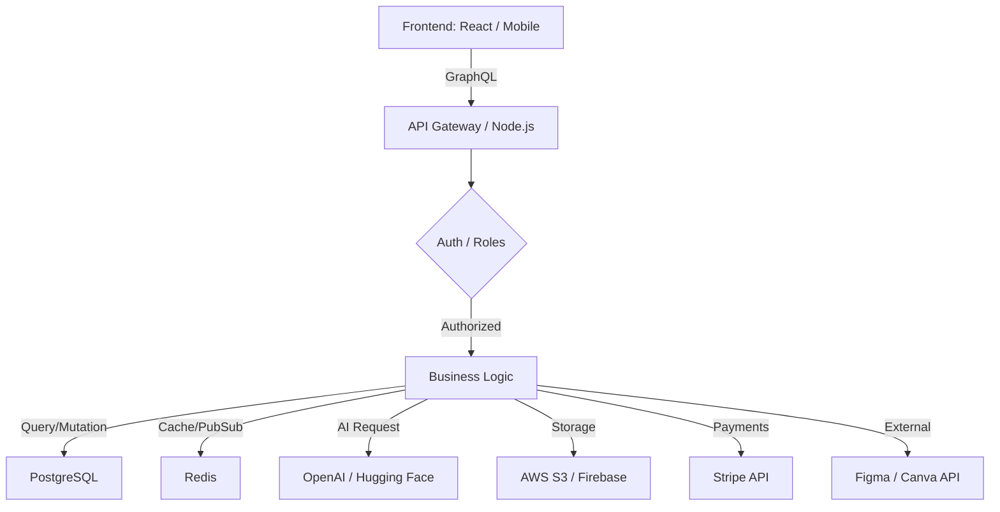

# ChromaSync / Aura - Backend Architecture & Implementation Plan

## 1. Arquitectura Backend

La arquitectura se basa en un modelo **SaaS Multitenant** escalable, utilizando **Node.js** con **GraphQL** para una gestión eficiente de datos y **PostgreSQL** como base de datos relacional.

### Tech Stack Recomendado:
- **Runtime:** Node.js (v20+) con **Fastify** (por su alto rendimiento).
- **API Layer:** **GraphQL (Apollo Server/Yoga)** para evitar over-fetching en móvil/web.
- **ORM:** **Prisma** para una gestión de base de datos tipada y segura.
- **Cache & Real-time:** **Redis** para caching de paletas populares y PubSub para colaboración.
- **Workers:** **BullMQ** para tareas pesadas (generación de mockups, exportación masiva).

### Diagrama de Arquitectura:


---

## 2. Flujos de Datos Internos

1.  **Sincronización Multi-dispositivo:** El cliente (PWA o Móvil) se conecta vía WebSockets (Redis PubSub) para recibir actualizaciones instantáneas de paletas guardadas o comentarios de equipo.
2.  **Pipeline de IA:**
    - Input: Texto ("Atardecer en Marte") o Imagen.
    - Backend: Envía a OpenAI (Embeddings + Chat Completion).
    - Result: Array de Hex-codes + Ratio de contraste.
    - Storage: Se guarda en PostgreSQL y se cachea el resultado en Redis.
3.  **Generación de Mockups:** El frontend envía la paleta; el backend usa un motor de renderizado (puppets/canvas) o API de Adobe para inyectar colores en templates predefinidos y devuelve el archivo resultante a S3.

---

## 3. Estructura de Base de Datos (PostgreSQL)

### Modelos Principales:

- **`User`**: `id`, `email`, `role` (Admin/Member), `plan` (Free/Plus/Pro), `stripe_customer_id`, `points`.
- **`Palette`**: `id`, `owner_id`, `colors` (JSONB), `accessibility_score`, `is_public`, `tags`.
- **`Moodboard`**: `id`, `user_id`, `palettes[]`, `images[]`, `references`.
- **`Collaboration`**: `id`, `resource_id` (Palette/Moodboard), `user_id`, `permission` (View/Edit).
- **`Comment`**: `id`, `resource_id`, `user_id`, `text`, `replies[]`.
- **`Gamification`**: `user_id`, `streak_days`, `badges[]`, `swipes_count`.

---

## 4. Logística de Planes y Pagos (Stripe)

| Feature | Free | Plus | Pro |
| :--- | :--- | :--- | :--- |
| Paletas/día | 5 | Ilimitadas | Ilimitadas |
| Mockups | Básicos | Básicos | Pro (Editables) |
| IA | Básica (Random) | Avanzada | Pro (Contextual) |
| Exportación | PNG/CSS | Full (SVG/PDF) | Plugins (Figma/Canva) |
| Equipo | No | 2 Miembros | Ilimitado |

**Flujo de Billing:**
1.  **Webhook de Stripe:** Escucha `customer.subscription.updated` y `invoice.paid`.
2.  **Grace Period:** Si el pago falla, se mantiene el plan Pro por 3 días antes de hacer downgrade automático a Plus/Free.
3.  **Primer Mes Gratis:** Configurado vía `price_id` en Stripe con `trial_period_days: 30`.

---

## 5. IA Engine (OpenAI + Custom ML)

- **Input de Color por Imagen:** Uso de **Hugging Face (ColorThief model)** para extraer colores dominantes y secundarios con precisión artística.
- **Generador de Tipografía:** OpenAI GPT-4o analiza la "emoción" de la paleta y sugiere 3 combinaciones de Google Fonts basadas en reglas de diseño editorial.
- **Recomendaciones:** Sistema de filtrado colaborativo (similar a Spotify) para sugerir paletas basadas en el historial del usuario y tendencias globales del feed.

---

## 6. Sistema de Exportación Avanzada

- **Figma:** Creación de un backend específico que genere un archivo `.figma` o use la **Plugin API** para inyectar estilos directamente en el documento abierto mediante un Token de Acceso.
- **Canva:** Integración vía **Design Button SDK** para enviar la paleta como "Brand Kit" efímero.
- **SVG/PDF:** Servidor de renderizado (Node-Canvas) que genera archivos listos para impresión (CMYK) para usuarios Pro.

---

## 7. Mecanismos de Colaboración

- **Roles:** `Owner`, `Editor`, `Viewer`.
- **Historial de Revisiones:** Tabla `PaletteHistory` que guarda snapshots cada vez que se modifica un color, permitiendo el "Undo/Redo" persistente en la nube.
- **Comentarios:** Hilos de discusión contextuales sobre colores específicos de la paleta.

---

## 8. Gamification (Engagement Engine)

- **Swipe Mode:** Interfaz táctil tipo Tinder para "Like/Dislike" de paletas generadas por IA. El algoritmo aprende de estos swipes para mejorar las sugerencias.
- **Creativity Feed:** Un muro público donde los usuarios Pro pueden "publicar" sus marcas. El engagement (likes, saves) otorga puntos de prestigio.
- **Ranks:** Junior Designer → Senior → Creative Director (basado en paletas guardadas y participación).

---

## 9. Automatización de Notificaciones

- **Email:** **Resend** o **SendGrid** para:
  - Resumen semanal de paletas tendencia.
  - Alertas de colaboración (alguien comentó tu moodboard).
- **Push:** **Firebase Cloud Messaging (FCM)** para:
  - Recordatorio de racha (Gamificación).
  - Renovación de suscripción exitosa.

---

## 10. Roadmap de Ejecución (MVP to Scale)

### Fase 1: Cimientos (4 semanas)
- Configuración de Server, DB y Auth.
- Generador aleatorio de paletas.
- Exportación básica (CSS/PNG).

### Fase 2: IA & Almacenamiento (3 semanas)
- Integración con OpenAI para generación semántica.
- Subida de imágenes y extracción de colores.
- CRUD de Moodboards.

### Fase 3: Monetización & Premium (3 semanas)
- Integración completa con Stripe.
- Lógica de permisos por plan.
- Mockups básicos.

### Fase 4: Ecosistema & Social (4 semanas)
- Plugins de Figma/Sketch.
- Feed interactivo y Swipe Mode.
- Colaboración en tiempo real.

---

## 11. QA, Seguridad y Accesibilidad

- **Accesibilidad:** Integración obligatoria de librería **ColorBlind** para simular: *Protanopia, Deuteranopia, Tritanopia*.
- **Seguridad:**
  - Rate Limiting por IP para evitar abuso del motor de IA.
  - Sanitización de inputs en GraphQL.
  - Encriptación de datos sensibles en la DB.
- **Performance:** Carga perezosa (Lazy Loading) de imágenes en mockups complejos.

---

## 12. Documentación de API (Ejemplos)

### `GET /palette/:id`
Devuelve detalles, colores hex, contrastes y sugerencias de tipografía.

### `POST /ai/generate`
```json
{
  "prompt": "Minimalist organic skincare brand",
  "num_colors": 5,
  "style": "pastel"
}
```

### `POST /export/figma`
Envía la paleta activa al webhook del plugin de Figma del usuario.
